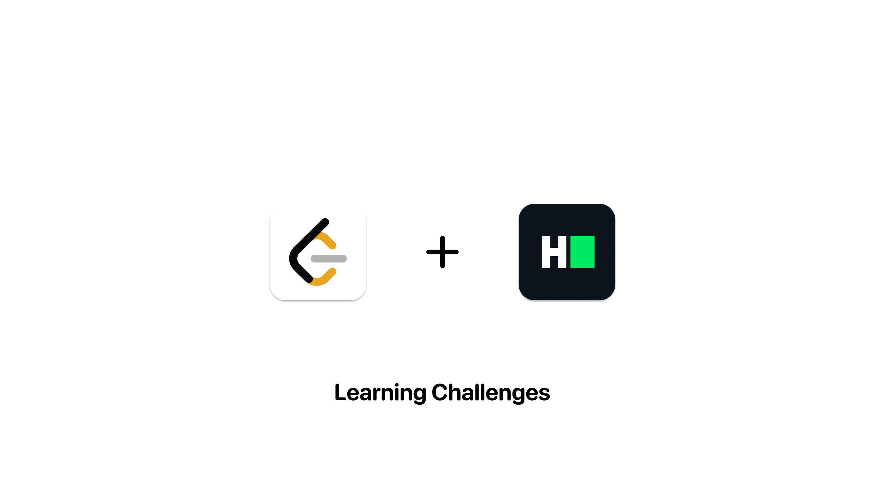

# LeetCode and HackerRank Solutions Repository

Welcome to the **LeetCode and HackerRank Solutions Repository**! This repository is a collection of solutions for coding challenges from both LeetCode and HackerRank platforms.

## Introduction

Coding challenges are a great way to sharpen your programming skills, tackle real-world problems, and prepare for technical interviews. This repository aims to provide a comprehensive set of solutions to various coding challenges from LeetCode and HackerRank.

## Explore the Repository

You can explore this repository to:

- Find solutions to a wide range of coding challenges.
- Understand different approaches and optimizations for solving problems.
- Learn from code examples and explanations provided for each challenge.

## Contribute

We encourage contributions from the coding community! You can contribute to this repository in the following ways:

- **Add Your Solutions**: If you have an alternate solution or a more efficient approach to a challenge, feel free to add your solution. We value diversity in coding styles and techniques.

- **Add More Challenges**: Expand the repository by adding new coding challenges from LeetCode or HackerRank. Provide clear problem statements and test cases.

To contribute, simply fork this repository, make your changes, and submit a pull request. Please follow the contribution guidelines in the repository for a smooth collaborative experience.

## Get Started

If you're new to coding challenges or want to practice your skills, this repository is a great resource to start with. Explore the challenges, read the problem statements, and examine the solutions. You can also use this repository to prepare for technical interviews and improve your problem-solving abilities.

We hope this repository serves as a valuable learning and sharing resource for the coding community. Happy coding!

## License

This repository is open-source and available under the [MIT License](LICENSE). By contributing to this repository, you agree to abide by
